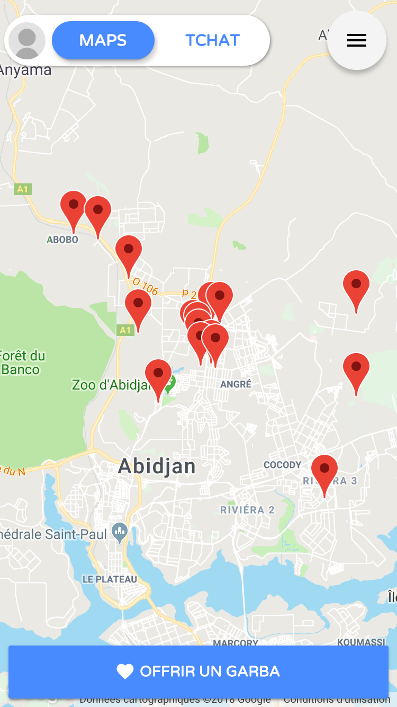
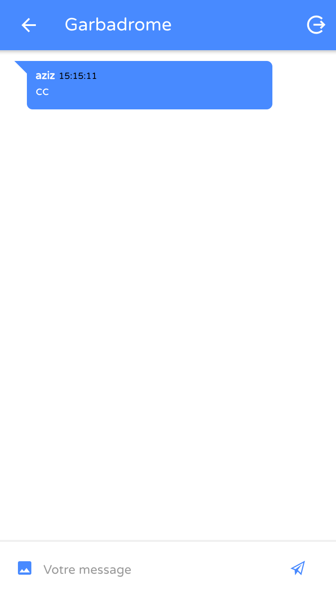

Simple, useful and efficient.

## Pourquoi ?

GarbaMap is cool and fun. This is a mobile application for Android and iOS that simply displays all the garbaromes on a map. :D




## Features
1. Geolocation and display of points on a map
2. Realtime chat - Group Chat
3. Make a donation with [CinetPay](https://cinetpay.com/) - Mobile Money payment
4. Upload Pictures
5. ...

## Setup
1. Install [Node js](http://nodejs.org/)
2. install [Ionic Framework](https://ionicframework.com/)
```bash
npm install -g ionic cordova
```
3. Create your [Firebase](https://firebase.google.com/) project
4. Use this configuration for use Firestore database in developer/database/rules
```bash
service cloud.firestore {
  match /databases/{database}/documents {
    match /{document=**} {
      allow read, write;
    }
  }
}
```
5. [Download](https://github.com/agazinakou/ionFood.git) or clone repository 
```bash
git clone https://github.com/agazinakou/ionFood.git
```
6. Click on "Add Firebase to your Web application" in the firebase console
7. Copy and paste the content into src/app/app.firebase.config.ts
```bash
export const FIREBASE_CONFIG = {
    apiKey: "XXXXXXXXXXXX",
    authDomain: "XXXXXXXXXXXX",
    databaseURL: "XXXXXXXXXXXX",
    projectId: "XXXXXXXXXXXX",
    storageBucket: "XXXXXXXXXXXX",
    messagingSenderId: "XXXXXXXXXXXX"
};
```
8. Use the terminal and go to the project directory
```bash
npm install
```
9. Installing on your phone :D
```bash
ionic cordova platform add android
ionic cordova build android
```

## Download

 - [Android](https://www.google.com/)
 - [iOS](https://www.google.com/)

## Environment

```bash
Ionic CLI: 3.15.2 or greater
Ionic Framework: ^3.7.1
Angularfire2: ^5.0.0-rc.3
Firebase: ^4.6.0
Cordova CLI: ^7.0.1
```

## Contact me 

If you need technical support or have any questions, please send a message to agazinakou@gmail.com or via skype: aziiin5.

Don't re-invent the wheel, Just re-align It.
